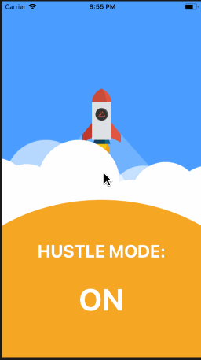

**Hustle** in  iOS .

Swift 4 -
Xcode 9.0.1 
1. UIkit.
2. AVKit framework.
4. AVPlayer
5. AVPlayerViewController.

**Hustle** is  animation using swift 4.

Submitted by: **Mayuresh Rao**

## User Stories

The following **required** functionality is complete:

* [x] Make the animation in the view .
* [x] Added sound effects to the project .

The following features are implemented:

Completed user stories:

* [x] Implemented the sound effects in the project.

## Video Walkthrough 

Here's a walkthrough of implemented user stories:

 

## Future implementation

The following features can be implemented in the current project:

* [x] Add more sound effect and more functionalities.
* [x] Sharing option and adding extensions.
